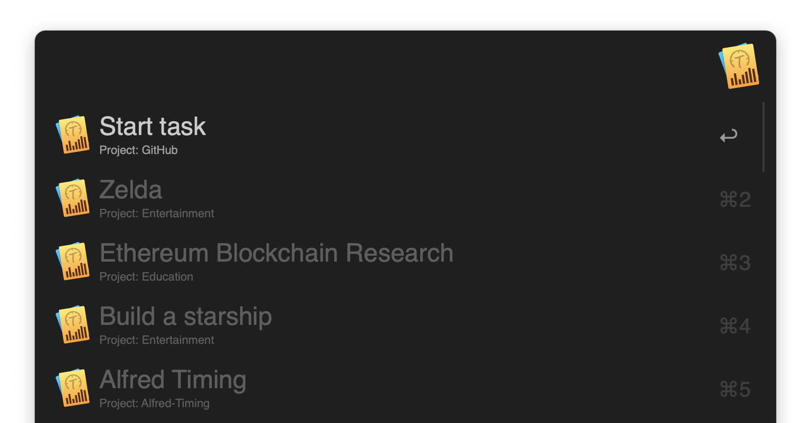
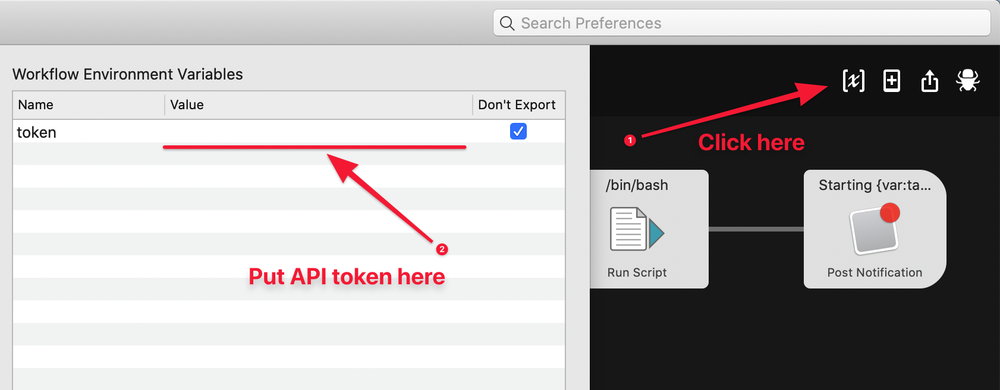

# alfred-timing [](https://travis-ci.org/skibitsky/alfred-timing)

> Alfred workflow for Timing app



## Install

```shell
npm install --global alfred-timing
```

_Requires [Node.js](https://nodejs.org) 8+ and the Alfred [Powerpack](https://www.alfredapp.com/powerpack/)._

0. Install workflow by running `$ npm install --global alfred-timing` in Terminal
1. Generate new Timing API token [here](https://web.timingapp.com/integrations/tokens)
2. Insert yout API token into the `token` field in "Workflow Environment Variables" window:
   

## Usage

In Alfred, type `t`, press <kbd>Return</kbd>, and enter your task.
You can create a new task or select the existing one (project will be selected automatically).

## Development

Use [alfred-link](https://github.com/SamVerschueren/alfred-link#development) to create a symlink in the Alfred workflows directory pointing to your development location.

```shell
npx alfred-link
```

## License

MIT © [skibitsky](http://skibitsky.com)

## Contributors

- Bhagya Silva (github.com/bhagyas)
- Daniel Willitzer (github.com/dwillitzer)
